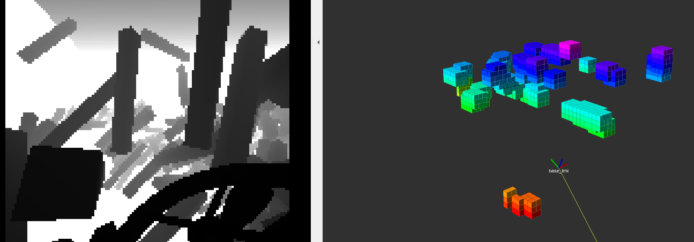

## 建图算法

建图代码摘选自 ego-planner-swarm 的 plan_env 目录，使用朴素的投射方法进行栅格地图的实时构建，在Intel i7-9750 CPU上运行可达到10Hz，CPU消耗占比40%

### 使用
```
#  开启D435i相机
roslaunch realsense2_camera rs_camera_d435i.launch

# 开启视觉里程计 VINS
roslaunch vins swarm_d435_no_rviz.launch

# 开启建图算法
roslaunch local_ocmap_gen grid_map.launch
```
